# Implementation Process Guide

> A complete reference for the Rovo Execution Guard agent-driven development pipeline,
> covering input/output templates, filesystem interaction scripts, and the end-to-end
> implementation workflow.

---

## Table of Contents

1. [Architecture Overview](#1-architecture-overview)
2. [The 7-Hat Agent Pipeline](#2-the-7-hat-agent-pipeline)
3. [Input / Output Templates](#3-input--output-templates)
4. [Filesystem Interaction Model](#4-filesystem-interaction-model)
5. [Task Lifecycle](#5-task-lifecycle)
6. [Triple Deliverable Pattern](#6-triple-deliverable-pattern)
7. [Quality Gates & Guardrails](#7-quality-gates--guardrails)
8. [Pipeline Execution Script](#8-pipeline-execution-script)
9. [Handoff Protocol](#9-handoff-protocol)
10. [Failure & Recovery Flows](#10-failure--recovery-flows)
11. [End-to-End Walkthrough](#11-end-to-end-walkthrough)

---

## 1. Architecture Overview

The system is an **event-driven orchestrator** (Ralph) that drives an AI agent (Claude) through a structured sequence of specialized roles called **hats**. Each hat has a single responsibility, reads from and writes to the filesystem, and hands off to the next hat via tokens.

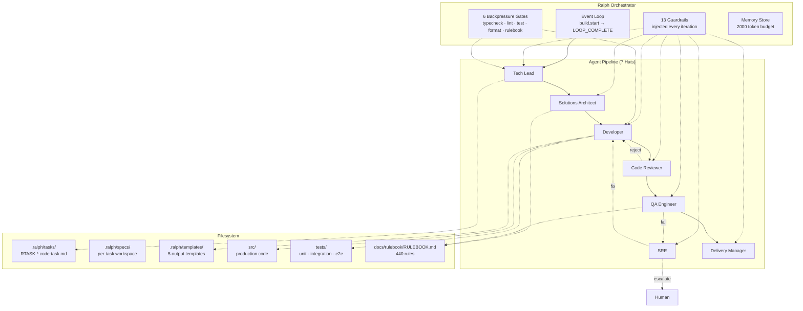

---

## 2. The 7-Hat Agent Pipeline

Each hat is a distinct role the AI agent assumes. Hats are activated by loading the corresponding `.cursor/rules/roles/*.mdc` file. The pipeline is strictly linear on the happy path, with defined failure loops.

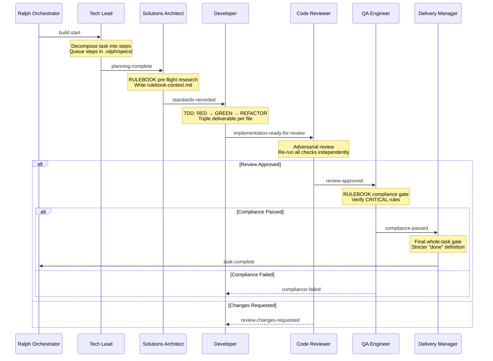

### Hat Responsibilities

| Hat | Role File | Reads | Writes | Never Does |
|-----|-----------|-------|--------|------------|
| **Tech Lead** | `tech-lead.mdc` | Task definition, dependency graph | Step queue in `.ralph/specs/` | Implements or reviews code |
| **Solutions Architect** | `solutions-architect.mdc` | RULEBOOK, task spec | `rulebook-context.md` (CRITICAL/HIGH rules) | Writes production code |
| **Developer** | `developer.mdc` | Step queue, templates, RULEBOOK context | `.ts` + `.reqs.md` + `.spec.ts` | Skips TDD phases |
| **Code Reviewer** | `reviewer.mdc` | All production + test files | Review notes, pass/reject | Modifies code directly |
| **QA Engineer** | `qa-engineer.mdc` | RULEBOOK, production code | Compliance report | Blocks on MEDIA-only violations |
| **SRE** | `sre.mdc` | Gate output, error logs | Fix (trivial) or escalation | Escalates after 3 same-gate failures |
| **Delivery Manager** | `delivery-manager.mdc` | Everything produced so far | Final sign-off or more-work-needed | Accepts partial work |

---

## 3. Input / Output Templates

Templates live in `.ralph/templates/` and enforce structural consistency across all agent output. Each template defines the exact schema the agent must follow.

### Template Inventory

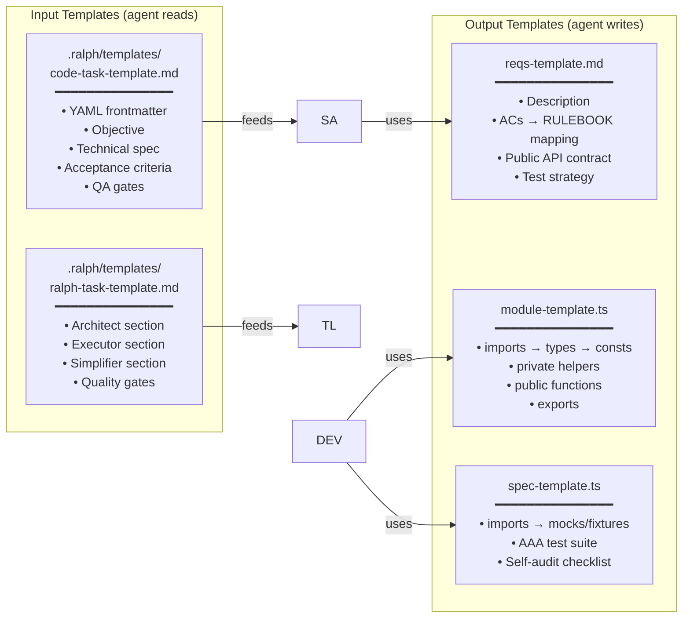

### 3.1 Task Input Template (`code-task-template.md`)

Every RTASK file follows this structure:

```yaml
---
id: RTASK-NNN
title: "Descriptive Title"
status: pending | in_progress | completed
priority: 1
type: domain | integration | orchestration | presentation | observability | configuration | cicd | testing | documentation | audit
dependencies: [RTASK-XXX, RTASK-YYY]
rulebook_refs: [CATEGORY-CORRELATIVO, ...]
spec: docs/tickets/TASK-NNN-slug.md
---
```

Followed by markdown sections:

| Section | Purpose |
|---------|---------|
| **Objective** | What and why — single paragraph |
| **Context** | What exists, what depends on this |
| **Technical Specification** | Detailed types, signatures, behavior |
| **Acceptance Criteria** | Numbered checkboxes (AC-01..AC-NN) |
| **QA Gates** | Pre/during/post gates |
| **Triple Deliverable** | File mapping (`.ts` / `.reqs.md` / `.spec.ts`) |
| **Implementation Protocol** | Step-by-step TDD instructions |
| **Auditing Protocol** | Critic checklist and rejection criteria |
| **Testing Protocol** | Test locations, categories, mock strategies |
| **Risks** | Risk/mitigation table |

### 3.2 Requirements Output Template (`reqs-template.md`)

Generated by the Solutions Architect or Developer for every production `.ts` file:

```markdown
# {module-name} Requirements

## Description
{What this module does and why}

## Acceptance Criteria → RULEBOOK Mapping
| AC | Requirement | RULEBOOK Rules | Priority |
|----|-------------|----------------|----------|
| AC-01 | ... | ARCH-SOLID-001 | CRITICAL |

## Public API Contract
{Function signatures, types, and guarantees}

## Test Strategy
{What to test, how, and coverage expectations}
```

### 3.3 Module Output Template (`module-template.ts`)

Enforces a strict internal ordering:

```
1. imports          — external → internal
2. local types      — interfaces, type aliases
3. constants        — readonly values
4. private helpers  — internal functions
5. public functions — exported API
6. exports          — barrel export
```

### 3.4 Spec Output Template (`spec-template.ts`)

Enforces the AAA (Arrange-Act-Assert) pattern:

```
1. imports          — test framework + module under test
2. mocks/fixtures   — test data and mocks
3. describe blocks  — grouped by function/behavior
   - arrange        — set up preconditions
   - act            — invoke the function
   - assert         — verify outcomes
4. self-audit       — checklist confirming all ACs covered
```

### 3.5 How Templates Flow Through the Pipeline

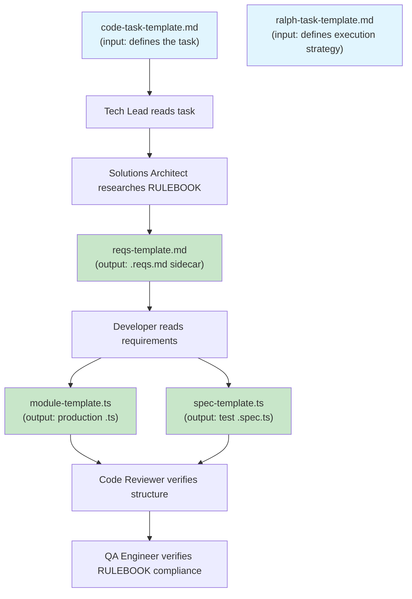

---

## 4. Filesystem Interaction Model

Agents interact with the filesystem through well-defined paths. Each directory serves a specific purpose in the pipeline.

### 4.1 Directory Map

```mermaid
graph TD
    ROOT["rovo-execution-guard/"]

    ROOT --> CURSOR[".cursor/rules/"]
    CURSOR --> ALWAYS["Always-on rules"]
    ALWAYS --> WF["workflow.mdc<br/>master pipeline"]
    ALWAYS --> GR["guardrails.mdc<br/>13 behavioral rules"]
    ALWAYS --> GT["gates.mdc<br/>6 shell gates"]
    ALWAYS --> PC["pipeline-contract.mdc<br/>handoff tokens"]
    CURSOR --> ROLES["roles/"]
    ROLES --> R1["tech-lead.mdc"]
    ROLES --> R2["solutions-architect.mdc"]
    ROLES --> R3["developer.mdc"]
    ROLES --> R4["reviewer.mdc"]
    ROLES --> R5["qa-engineer.mdc"]
    ROLES --> R6["sre.mdc"]
    ROLES --> R7["delivery-manager.mdc"]

    ROOT --> RALPH[".ralph/"]
    RALPH --> TASKS["tasks/<br/>32 RTASK-*.code-task.md"]
    RALPH --> SPECS["specs/<br/>per-task workspace"]
    RALPH --> TMPL["templates/<br/>5 output templates"]
    RALPH --> AGENT["agent/<br/>runtime state"]
    RALPH --> LOGS["pipeline-logs/<br/>execution logs"]

    ROOT --> SRC["src/"]
    SRC --> BACK["backend/"]
    BACK --> TYPES["types/<br/>12 domain type files"]
    BACK --> SERVICES["services/scoring/<br/>3 domain services"]
    SRC --> FRONT["frontend/<br/>UI (placeholder)"]

    ROOT --> TESTS["tests/"]
    TESTS --> UNIT["unit/<br/>type + service tests"]
    TESTS --> INT["integration/"]
    TESTS --> E2E["e2e/"]

    ROOT --> DOCS["docs/"]
    DOCS --> RB["rulebook/<br/>RULEBOOK.md (440 rules)"]
    DOCS --> ARCH["architecture/"]
    DOCS --> RDOC["ralph/"]

    ROOT --> SCRIPTS["scripts/<br/>ralph-pipeline.sh"]

    style RALPH fill:#fff9c4
    style SRC fill:#c8e6c9
    style TESTS fill:#e1bee7
    style DOCS fill:#bbdefb
```

### 4.2 Agent Filesystem Read/Write Matrix

| Directory | Tech Lead | Architect | Developer | Reviewer | QA | SRE | Delivery Mgr |
|-----------|:---------:|:---------:|:---------:|:--------:|:--:|:---:|:------------:|
| `.ralph/tasks/` | R | R | R | R | R | R | R |
| `.ralph/specs/` | **RW** | R | R | R | R | R | R |
| `.ralph/templates/` | — | R | R | R | — | — | — |
| `.ralph/agent/` | R | R | R | R | R | R | R |
| `docs/rulebook/` | R | **RW** | R | R | R | R | R |
| `src/` | — | — | **RW** | R | R | **RW*** | R |
| `tests/` | — | — | **RW** | R | R | **RW*** | R |
| `scripts/` | — | — | — | — | — | R | R |

**RW** = read + write, **RW*** = write only for trivial fixes, **R** = read-only, **—** = no access

### 4.3 Per-Task Workspace Lifecycle

Each task gets its own workspace under `.ralph/specs/{task-id}/`:

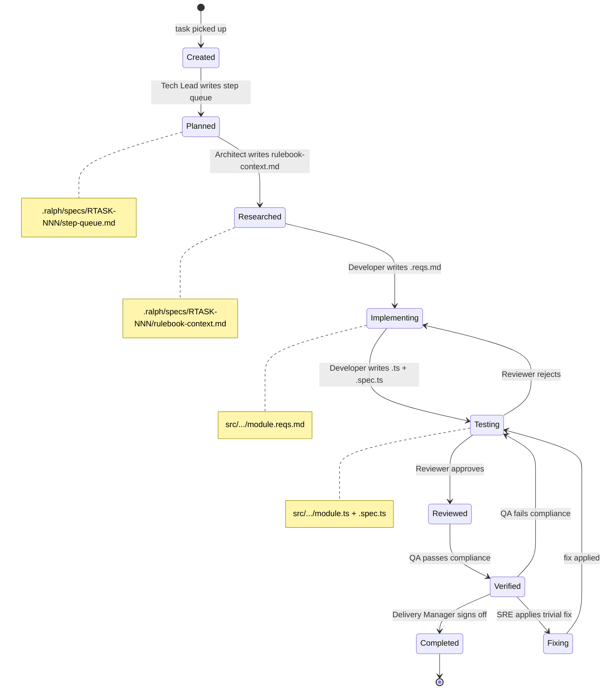

---

## 5. Task Lifecycle

### 5.1 Task Dependency Graph

Tasks execute in strict dependency order. The graph below shows the major phases:

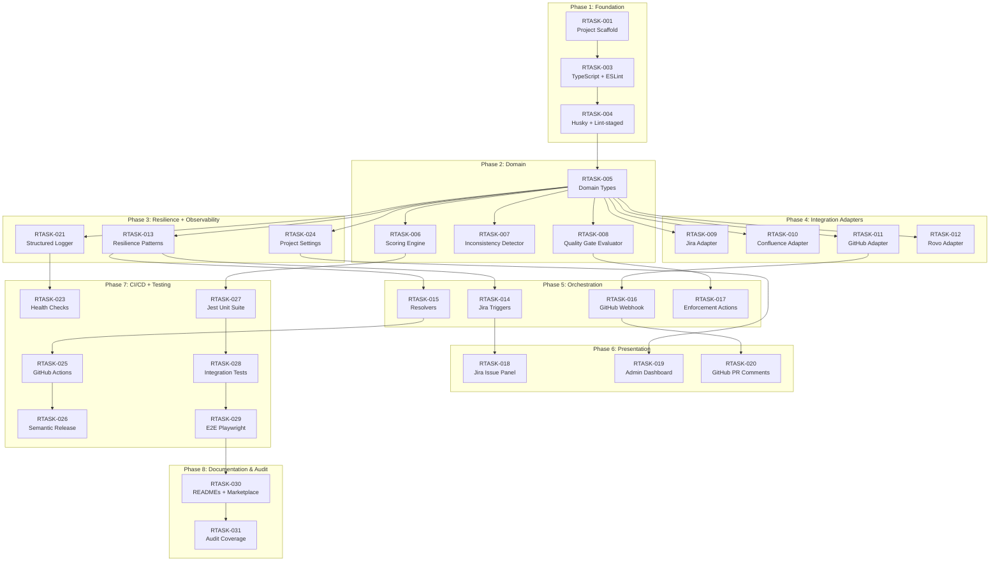

### 5.2 Task Status Flow

```mermaid
stateDiagram-v2
    [*] --> pending: task created
    pending --> in_progress: Ralph picks up task
    in_progress --> pending: planning-complete (next step)
    in_progress --> completed: task-complete token
    in_progress --> blocked: work-blocked token
    blocked --> in_progress: human unblocks
    completed --> [*]

    note right of pending: status: pending in frontmatter
    note right of in_progress: status: in_progress
    note right of completed: status: completed
    note right of blocked: logged in .ralph/agent/
```

---

## 6. Triple Deliverable Pattern

Every production file produces **exactly three artifacts**, created in strict order:

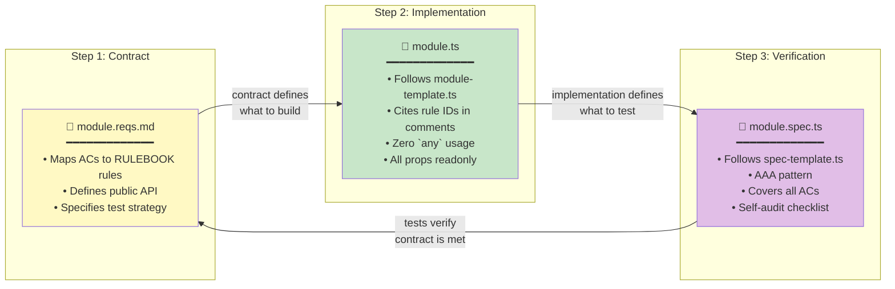

### Triple Deliverable per File Example

For `src/backend/services/scoring/scoring-engine.ts`:

| Artifact | Path | Created By |
|----------|------|------------|
| Requirements | `src/backend/services/scoring/scoring-engine.reqs.md` | Developer (before code) |
| Implementation | `src/backend/services/scoring/scoring-engine.ts` | Developer (TDD) |
| Tests | `tests/unit/services/scoring/scoring-engine.spec.ts` | Developer (TDD) |

---

## 7. Quality Gates & Guardrails

### 7.1 Backpressure Gates (run every iteration)

All 6 gates must pass (exit 0) before any code is written:

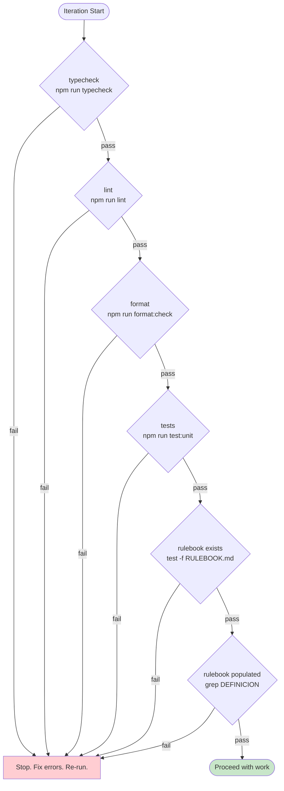

### 7.2 Guardrails (always active)

13 behavioral rules injected into every agent iteration:

| # | Guardrail | Effect |
|---|-----------|--------|
| 1 | Fresh context | No stale state across iterations |
| 2 | Triple deliverable | Every `.ts` needs `.reqs.md` + `.spec.ts` |
| 3 | Verification mandatory | Typecheck, lint, tests must pass |
| 4 | Zero `any` | No `any` type usage anywhere |
| 5 | Read-only domain types | Never modify `src/backend/types/` without CRITICAL reason |
| 6 | Read RULEBOOK first | Must read rules before writing code |
| 7 | Follow templates | Use `.ralph/templates/` for all output |
| 8 | Confidence protocol | >80% proceed, 50-80% note uncertainty, <50% safe default |
| 9 | No over-engineering | Only what the task requires |
| 10 | Commit per subtask | Never commit `.ralph/` files |
| 11 | Re-read RULEBOOK | Fresh read every iteration |
| 12 | Cite rule IDs | `[ARCH-SOLID-001]` in code comments |
| 13 | Block on CRITICAL | Stop progress on CRITICAL violations |

---

## 8. Pipeline Execution Script

The `scripts/ralph-pipeline.sh` script orchestrates all 32 tasks sequentially with QA enforcement.

### 8.1 Script Flow

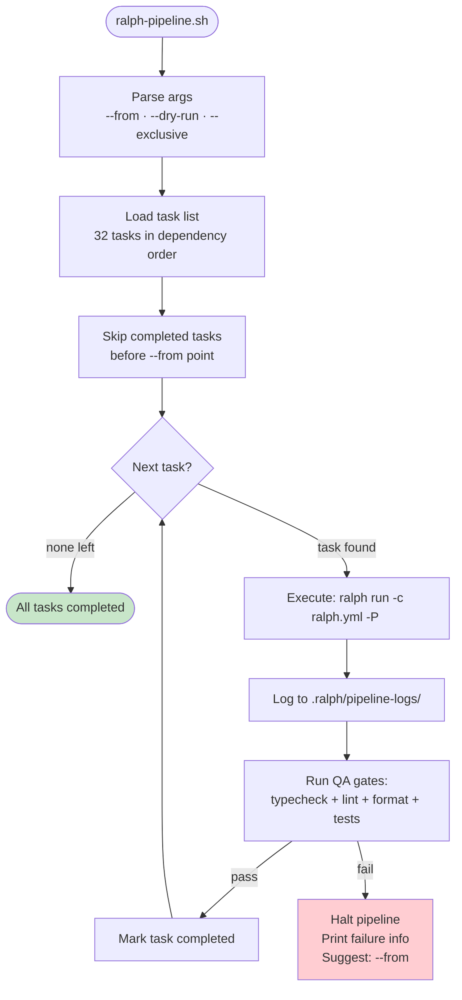

### 8.2 Usage

```bash
# Run all tasks (resumes from where it left off)
./scripts/ralph-pipeline.sh

# Start from a specific task
./scripts/ralph-pipeline.sh --from 006

# Preview without executing
./scripts/ralph-pipeline.sh --dry-run

# Exclusive mode (no parallel runs)
./scripts/ralph-pipeline.sh --exclusive
```

---

## 9. Handoff Protocol

When transferring between hats, the outgoing hat must produce a structured handoff:

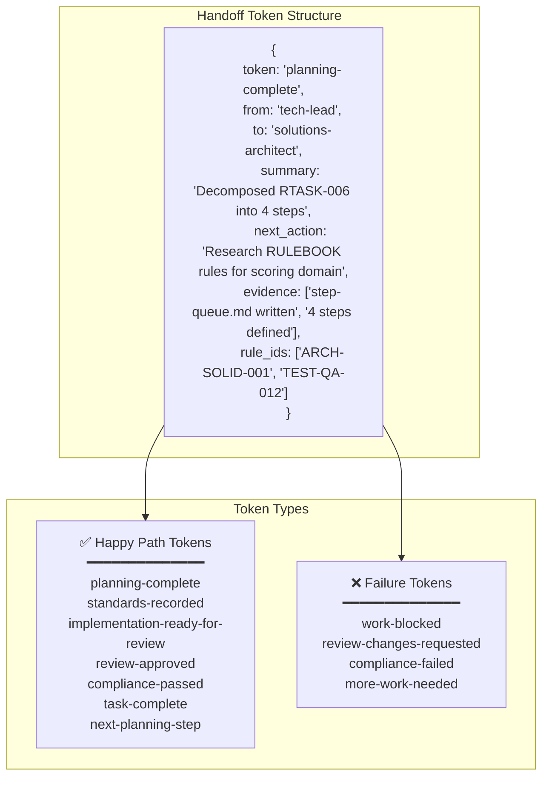

### Handoff Fields

| Field | Required | Description |
|-------|----------|-------------|
| `token` | Yes | The handoff token name |
| `from` | Yes | Current hat name |
| `to` | Yes | Next hat name |
| `summary` | Yes | What was accomplished |
| `next_action` | Yes | What the next hat should do |
| `evidence` | Yes | Commands run, outputs, files written |
| `rule_ids` | Yes | RULEBOOK rules cited during work |

---

## 10. Failure & Recovery Flows

The pipeline is self-correcting with defined escalation paths:

```mermaid
flowchart TD
    subgraph "Review Failure"
        REV_FAIL["Reviewer rejects code"] --> REV_DIAG{Reason?}
        REV_DIAG -->|Missing tests| DEV_BACK["Developer: add tests"]
        REV_DIAG -->|Structure violation| DEV_FIX["Developer: refactor to template"]
        REV_DIAG -->|Logic error| DEV_LOGIC["Developer: fix logic"]
        DEV_BACK --> RESUBMIT1[Resubmit for review]
        DEV_FIX --> RESUBMIT1
        DEV_LOGIC --> RESUBMIT1
    end

    subgraph "Compliance Failure"
        QA_FAIL["QA fails compliance"] --> SRE_DIAG[SRE diagnoses]
        SRE_DIAG --> SRE_CHECK{Trivial fix?}
        SRE_CHECK -->|Yes| SRE_FIX["SRE applies fix directly"]
        SRE_CHECK -->|No| SRE_COUNT[Increment failure count]
        SRE_COUNT --> SRE_3{3 consecutive<br/>same-gate failures?}
        SRE_3 -->|No| DEV_RETRY["Developer: retry"]
        SRE_3 -->|Yes| ESCALATE["⚠️ Escalate to human"]
        SRE_FIX --> RETRY_QA[Re-run QA]
        DEV_RETRY --> RETRY_QA
    end

    subgraph "Gate Failure"
        GATE_FAIL["Gate command exits non-zero"] --> GATE_DIAG{Which gate?}
        GATE_DIAG -->|Typecheck| TS_FIX["Fix type errors"]
        GATE_DIAG -->|Lint| LN_FIX["Fix lint errors"]
        GATE_DIAG -->|Tests| UT_FIX["Fix failing tests"]
        GATE_DIAG -->|Format| FM_FIX["Run npm run format"]
        TS_FIX --> RE_GATE[Re-run all gates]
        LN_FIX --> RE_GATE
        UT_FIX --> RE_GATE
        FM_FIX --> RE_GATE
    end

    style ESCALATE fill:#ffcdd2
    style RESUBMIT1 fill:#fff9c4
    style RETRY_QA fill:#fff9c4
    style RE_GATE fill:#fff9c4
```

### Escalation Rules

| Condition | Action |
|-----------|--------|
| 3 consecutive same-gate failures | SRE escalates to human |
| Reviewer rejects 3 times on same step | Tech Lead re-decomposes |
| Gate failure after SRE fix attempt | Escalate to human |
| CRITICAL RULEBOOK violation | Immediate halt, human decision |

---

## 11. End-to-End Walkthrough

This section shows a complete task execution from start to finish.

### Example: RTASK-006 (Domain Scoring Engine)

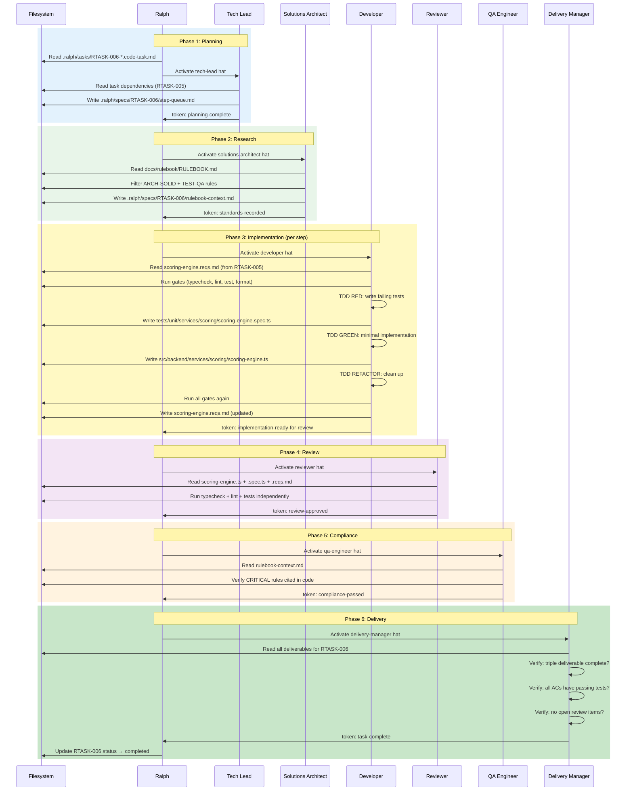

### Files Produced for RTASK-006

```
src/backend/services/scoring/
├── scoring-engine.reqs.md          ← requirements sidecar
├── scoring-engine.ts               ← production implementation
└── quality-gate-rules.reqs.md      ← requirements sidecar
    quality-gate-rules.ts           ← production implementation

tests/unit/services/scoring/
├── scoring-engine.spec.ts          ← unit tests
└── quality-gate-rules.spec.ts     ← unit tests

.ralph/specs/RTASK-006/
├── step-queue.md                   ← Tech Lead's decomposition
└── rulebook-context.md             ← Architect's RULEBOOK research
```

---

## Summary

The implementation process follows a **structured, self-correcting pipeline**:

1. **Templates** define the shape of all input (task definitions) and output (code, requirements, tests)
2. **7 specialized hats** each own one concern — decomposition, research, implementation, review, compliance, diagnosis, or delivery
3. **Handoff tokens** enforce explicit, auditable transitions between hats
4. **Quality gates** run on every iteration, providing continuous backpressure
5. **The triple deliverable** (`.reqs.md` + `.ts` + `.spec.ts`) ensures nothing ships without a contract, implementation, and verification
6. **Failure loops** self-correct (review → rework, gate → fix) with human escalation after 3 consecutive failures
7. **The pipeline script** (`scripts/ralph-pipeline.sh`) automates sequential execution of all 32 tasks with dependency ordering
