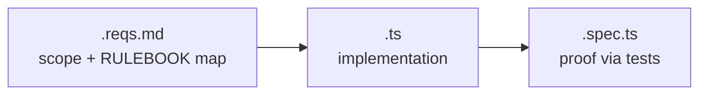
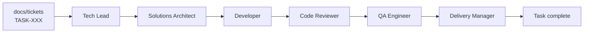
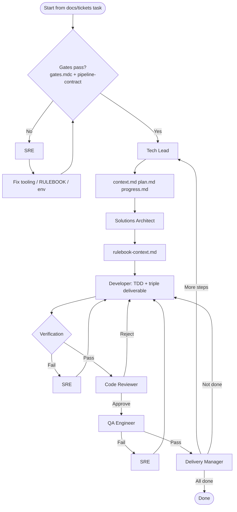

# Task implementation flow (Cursor rules)

This document explains how we implement work that starts from a ticket in `docs/tickets/`, using the rules under `.cursor/rules/`. It is written for the **whole team**: engineers, leads, and anyone who asks _“what does this role do?”_ or _“what exactly are we supposed to produce?”_

The flow mirrors `.cursor/rules/workflow.mdc` (seven roles), plus always-on **`gates.mdc`**, **`guardrails.mdc`**, and **`pipeline-contract.mdc`** (handoff tokens, RULEBOOK read order, gates on every implementation iteration).

**Repository paths** (specification workspace, task files, templates) are listed in **`AGENTS.md`** at the repo root — use that as the single path reference.

---

## 1. Deliverables: what we produce

### 1.1 Ticket (input, not code)

**Location:** `docs/tickets/TASK-XXX-*.md`

**What it contains:** The product/engineering definition of the task: objective, context, technical notes, acceptance criteria, dependencies on other tasks, and pointers to the RULEBOOK where relevant.

**Why it exists:** It is the **agreed scope** everyone aligns on. Implementation must satisfy the ticket’s acceptance criteria, not an informal interpretation.

---

### 1.2 Triple deliverable (main code output)

For **each new production `.ts` module** (unless the ticket explicitly exempts that file), the Developer produces **three files** in this order:

| File           | Purpose                                                                | Typical contents                                                                                                                                                                                                                                       |
| -------------- | ---------------------------------------------------------------------- | ------------------------------------------------------------------------------------------------------------------------------------------------------------------------------------------------------------------------------------------------------ |
| **`.reqs.md`** | Requirements **sidecar** — traceability from ticket + RULEBOOK to code | Linked path to the `.ts` file; short **description** of the module; **acceptance criteria** checkboxes; **RULEBOOK rule IDs** that apply; **public API** (exported functions/types) and behavior notes. Use the reqs template path in **`AGENTS.md`**. |
| **`.ts`**      | **Production implementation**                                          | The actual module: types, functions, classes — no test-only shortcuts; must respect RULEBOOK and `.reqs.md`.                                                                                                                                           |
| **`.spec.ts`** | **Automated tests**                                                    | Unit tests (e.g. Jest) proving behavior; drives **TDD** (red → green → refactor). Follow patterns from the spec template path in **`AGENTS.md`**.                                                                                                      |

**Why three files:** Regulators and reviewers can see **what** was promised (reqs), **what** shipped (code), and **proof** it works (tests) without digging through one giant file.

**Infrastructure-only changes** (config, hooks, no new app module) may skip `.spec.ts` if the ticket says verification is by **commands** only (still subject to `gates.mdc`).

---

### 1.3 Working documents (planning and traceability)

These live in the **specification workspace** for `{task_name}` (concrete path: **`AGENTS.md`** → Repository paths). They are **working artifacts**, not necessarily merged as product deliverables, but they explain _how_ we got to the code.

| File                      | Who owns it                              | What it contains                                                                                                                                                       |
| ------------------------- | ---------------------------------------- | ---------------------------------------------------------------------------------------------------------------------------------------------------------------------- |
| **`context.md`**          | Tech Lead (initially); updated as needed | Task context: acceptance criteria summary, constraints, dependencies, relevant RULEBOOK themes — **single place** for “what is this task about?”                       |
| **`plan.md`**             | Tech Lead                                | **Numbered high-level steps** and how work is split into **waves** (only one step’s worth of runtime work active at a time)                                            |
| **`progress.md`**         | Developer / all roles                    | Current step, what was done, **command outputs** (typecheck, lint, tests), review / compliance notes, debug sessions                                                   |
| **`rulebook-context.md`** | Solutions Architect                      | Extract of **CRITICAL** and **HIGH** RULEBOOK rules that apply to **this** task; API limits/permissions if relevant — **input** for Developer and **checklist** for QA |

---

### 1.4 Optional: machine-oriented task definition

**Location:** See **Task definition files** in **`AGENTS.md`** (e.g. `RTASK-*.code-task.md` under the repo’s task folder).

**What it is:** A structured task spec used when **automated runners** execute the pipeline. The Tech Lead still reasons from the **ticket**; the machine-oriented file may mirror or refine that into executable steps.

---

### 1.5 Templates (not deliverables — scaffolding)

**Location:** **Code / reqs templates** in **`AGENTS.md`**.

**What they are:** **Starting points** for `.reqs.md`, `.ts`, and `.spec.ts` so format stays consistent across the repo. Developers copy or follow them; they are not “submitted” as the task output.

---

## 2. Roles explained (for stakeholder Q&A)

Each role has a **single focus**. In Cursor, role rules live in `.cursor/rules/roles/<role>.mdc`. Ask the AI to **act as that role** when you want that lens (e.g. “Act as Code Reviewer”).

Between phases, **`pipeline-contract.mdc`** defines **`Workflow handoff: <token>`** lines (e.g. `planning-complete`, `standards-recorded`, `implementation-ready-for-review`) so logs stay consistent.

---

### Tech Lead

**Job in one sentence:** Break the ticket into **clear steps** and manage **what runs now** vs later — **without writing production code**.

**What they do:**

- Read the ticket (and optional machine-oriented task file per **`AGENTS.md`**).
- Create or refresh **`context.md`**, **`plan.md`**, and **`progress.md`** in the specification workspace.
- Ensure only **one step’s wave** of work is in flight at a time (no “implement the whole epic in one go”).
- Hand off to **Solutions Architect** with a plan everyone can follow.

**What they do _not_ do:** Implement features, review code as final authority, or skip planning.

**Rule file:** `.cursor/rules/roles/tech-lead.mdc`

---

### Solutions Architect

**Job in one sentence:** Do **RULEBOOK pre-flight** so the Developer knows **which rules are mandatory** before typing implementation.

**What they do:**

- Read **`docs/rulebook/RULEBOOK.md`**, **`docs/rulebook/RULEBOOK-INDEX.md`**, and **`docs/rulebook/RULEBOOK-WORKFLOW-GUIDE.md`** to map **categories** to this task.
- Extract **CRITICAL** and **HIGH** rules; note **API/platform** constraints (Forge, Rovo, GitHub, Jira) when applicable.
- Write **`rulebook-context.md`** in the specification workspace (must be non-empty when this step is required).

**What they do _not_ do:** Replace the ticket’s acceptance criteria; invent rules that are not in the RULEBOOK.

**Rule file:** `.cursor/rules/roles/solutions-architect.mdc`

---

### Developer

**Job in one sentence:** Implement **one** focused increment with **TDD** and the **triple deliverable**, and **prove** quality with commands.

**What they do:**

- Follow **`rulebook-context.md`**, templates (**`AGENTS.md`**), and the ticket.
- **RED → GREEN → REFACTOR:** tests first, then code, then cleanup.
- Produce **`.reqs.md` → `.ts` → `.spec.ts`** per new module (unless exempt).
- Run **`npm run typecheck`**, **`lint`**, **`test:unit`**, **`format:check`** and record evidence in **`progress.md`**.
- Commit with the agreed message format when applicable; hand off to **Code Reviewer**.

**What they do _not_ do:** Batch unrelated tasks; claim “green” without running checks; use `any` (see guardrails).

**Rule file:** `.cursor/rules/roles/developer.mdc`

---

### Code Reviewer

**Job in one sentence:** **Adversarial** review of the latest increment — assume bugs until **evidence** says otherwise.

**What they do:**

- Check **requirement fit** (ticket + reqs sidecar).
- Check **triple deliverable** completeness and template quality.
- **Re-run** typecheck, lint, and unit tests — do not trust unchecked “it passes”.
- Flag **over-engineering** and scope creep.

**Outcomes:** **Approve** (send to QA Engineer) or **Reject** with concrete fixes (back to Developer).

**Rule file:** `.cursor/rules/roles/reviewer.mdc`

---

### QA Engineer

**Job in one sentence:** **RULEBOOK compliance gate** — especially **CRITICAL** rules — after code review is satisfied with _code quality_.

**What they do:**

- Read **`rulebook-context.md`**, the RULEBOOK, and the changed files.
- Verify every applicable **CRITICAL** rule is met; **HIGH** rules verified or **documented exception**; do **not** block on style-only or non-applicable categories.

**Outcomes:** **Pass** (to Delivery Manager) or **Fail** with rule ID + file/line + required correction (often via SRE/Developer loop).

**Rule file:** `.cursor/rules/roles/qa-engineer.mdc`

---

### SRE (Site Reliability / debug owner in this flow)

**Job in one sentence:** When **gates fail**, work is **blocked**, or **compliance** fails, **diagnose**, fix **trivial** issues, or **escalate** — and avoid infinite retry loops.

**What they do:**

- Capture **exact** error output; map to RULEBOOK or tooling if relevant.
- **Trivial fix** → apply and send work back through the pipeline.
- **Same failure three times** → escalate to a human instead of spinning.
- Log a short **debug session** in **`progress.md`**.

**What they do _not_ do:** Weaken gates silently or bypass QA/RULEBOOK without explicit human decision.

**Rule file:** `.cursor/rules/roles/sre.mdc`

---

### Delivery Manager

**Job in one sentence:** Decide if the **entire ticket** is **truly done** — stricter than Developer and Code Reviewer.

**What they do:**

- Re-read **`plan.md`** and **`progress.md`**: all steps and tracked tasks closed?
- Confirm **quality commands** still pass and **definition of done** matches the ticket (files exist, no stray `any`, edge cases considered).
- Either: **complete** the task, **advance** to the next planned step/wave, or **send back** for more work with clear gaps.

**Rule file:** `.cursor/rules/roles/delivery-manager.mdc`

---

### Optional: diagram alignment with external runners

If your team uses an **external orchestrated pipeline** (separate from Cursor), role boundaries and ordering may be illustrated in **`docs/ralph/hats.md`** and **`docs/ralph/event-flow.md`**. The **Cursor rules** above remain the contract for work done in the IDE.

---

## 3. Supporting concepts (when people ask “what is X?”)

### Gates (`gates.mdc`)

**What:** **Preconditions** before we treat implementation as allowed: TypeScript compile, ESLint, unit tests, Prettier check, and **RULEBOOK file exists and has content** (`DEFINICION` check).

**Why:** Stops work from piling up on a broken baseline or missing compliance source.

**Iteration rule:** **`pipeline-contract.mdc`** requires running the full gate list again when **resuming** work after a pause or failure — not only on the first message of a chat.

---

### Pipeline contract (`pipeline-contract.mdc`)

**What:** Neutral **handoff tokens** (`Workflow handoff: …`), mandatory **RULEBOOK read order** before standards/implementation work, and **per-iteration** gate discipline.

**Why:** Keeps multi-role simulation consistent without depending on a specific external product.

---

### Guardrails (`guardrails.mdc`)

**What:** **Behavior rules** on every interaction: e.g. no `any`, re-read specs, cite RULEBOOK IDs in code, do not commit **ephemeral task-automation output** (logs, locks, local loop files — see **`AGENTS.md`**).

**Why:** Keeps AI and humans aligned on non-negotiable engineering standards.

---

### RULEBOOK set (canonical under `docs/rulebook/`)

| File                                           | Role                                     |
| ---------------------------------------------- | ---------------------------------------- |
| **`docs/rulebook/RULEBOOK.md`**                | Full rules (IDs, categories, priorities) |
| **`docs/rulebook/RULEBOOK-INDEX.md`**          | Category → task-type mapping             |
| **`docs/rulebook/RULEBOOK-WORKFLOW-GUIDE.md`** | Short workflow-oriented summary          |

---

## 4. Diagrams (quick visual)

### Happy path (roles only)

### End-to-end (gates, artifacts, retries)

---

## 5. Using this in Cursor

- **Always on:** `workflow.mdc`, `guardrails.mdc`, `gates.mdc`, **`pipeline-contract.mdc`**.
- **Per role:** `.cursor/rules/roles/*.mdc` — use **explicit prompts** (“Act as …”) so the right rule attaches.
- **Paths and RULEBOOK table:** **`AGENTS.md`**.

---

## Related docs

- [cursor-workflow-vs-adhoc-token-comparison.md](./cursor-workflow-vs-adhoc-token-comparison.md) — token usage: structured workflow vs paste-ticket ad-hoc
- [experiments/EXP-001-workflow-vs-plan-mode.md](./experiments/EXP-001-workflow-vs-plan-mode.md) — experiment: full workflow vs Plan mode
- [cursor-ralph-skills-parity.md](./cursor-ralph-skills-parity.md) — how `.cursor` rules relate to other automation (`pipeline-contract.mdc`)
- **`AGENTS.md`** (repo root) — paths and RULEBOOK quick links
- `.cursor/rules/workflow.mdc`, `.cursor/rules/pipeline-contract.mdc` — machine-readable contract
- `docs/ralph/hats.md`, `docs/ralph/event-flow.md` — optional diagrams for external orchestration
- `docs/tickets/README.md` — ticket index and dependencies
