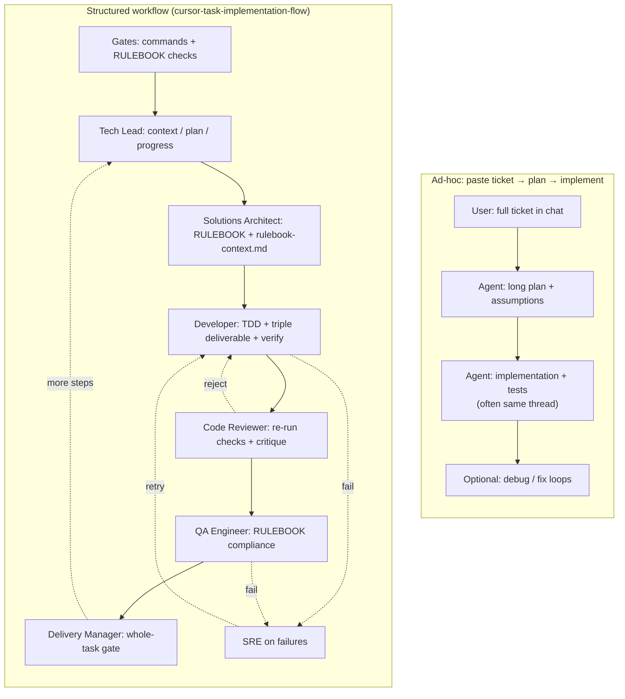
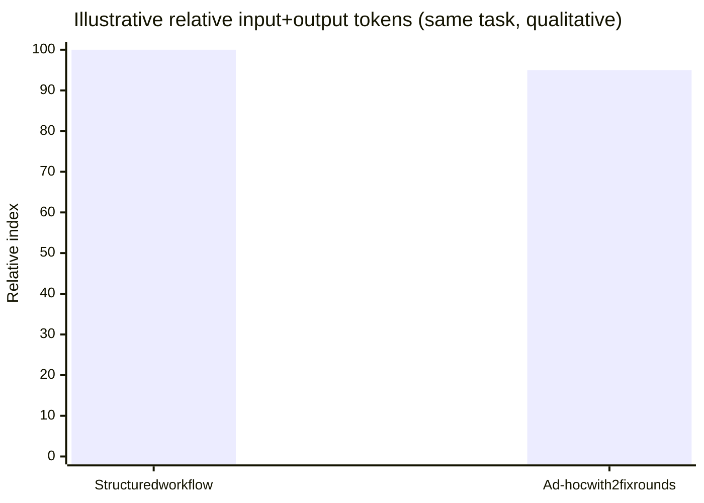

# Token usage: structured workflow vs ad-hoc “paste ticket → plan → code”

This document **compares two ways of using Cursor** on the same ticket. It is meant for team discussions — **not** as measured billing data. Real token counts depend on model, chat length, how many files the agent reads, and whether you use Max Mode or long outputs.

**Structured workflow** = the process in [cursor-task-implementation-flow.md](./cursor-task-implementation-flow.md): gates, guardrails, seven roles, artifacts (`context.md`, `rulebook-context.md`, triple deliverable, reviews).

**Ad-hoc** = paste the ticket into one chat, ask for a plan, then ask the agent to implement in the same thread (minimal formal handoffs, no role rules, often no separate RULEBOOK pre-flight artifact).

---

## 1. What actually burns tokens?

| Driver                      | Structured workflow                                                                                                                            | Ad-hoc paste → plan → code                                                                                                 |
| --------------------------- | ---------------------------------------------------------------------------------------------------------------------------------------------- | -------------------------------------------------------------------------------------------------------------------------- |
| **System / project rules**  | `workflow.mdc`, `guardrails.mdc`, `gates.mdc` on **every** message (always-on).                                                                | Often **lighter** if the user relies on defaults and does not attach rules.                                                |
| **Role rules**              | Invoking roles loads `.cursor/rules/roles/*.mdc` **per session or per explicit ask** — adds chunks several times across the “team” simulation. | Usually **none** unless you @-mention files.                                                                               |
| **Repeated document reads** | RULEBOOK slices, templates, `progress.md`, diffs — **intentionally re-read** at handoffs.                                                      | Fewer **named** artifacts; agent may still **glob-read** large files or re-read the whole ticket many times in one thread. |
| **Conversation turns**      | More **short, focused** phases (plan → research → code → review → QA).                                                                         | Often **fewer labeled phases**, but **longer** monolithic replies (plan + code + explanation in fewer turns).              |
| **Verification**            | Typecheck/lint/test outputs pasted or summarized **multiple times** (Developer, Reviewer, Delivery Manager).                                   | May run commands **once** or skip until something breaks — **rework** can create **spiky** late token use.                 |
| **Rework**                  | Review reject and QA fail are **expected paths** — bounded by process.                                                                         | Missed ACs or RULEBOOK gaps often surface **late** → big “fix everything” passes that **inflate** total tokens.            |

**Takeaway:** The structured workflow usually pays **more tokens up front** for discipline; ad-hoc can look **cheaper until rework** or huge exploratory reads dominate.

---

## 2. Diagram — two pipelines (what gets loaded, when)

Same ticket; different **shapes** of work. Box size is **schematic** (more boxes ≈ more distinct context loads / turns), not proportional to exact tokens.

**How to read it for tokens:** the **structured** path has **more explicit stages** (each may add rules + file context). The **ad-hoc** path has **fewer stages** but each stage can be **very large** (whole plan + whole implementation in one or two replies), and **A4** can dominate totals if quality was skipped early.

---

## 3. Diagram — illustrative relative totals (first-time completion)

The chart below is **not** from your invoice. It models a **single medium task** where:

- **Structured:** everyone follows the flow; one review cycle; no escalation.
- **Ad-hoc:** two rounds of “fix tests / fix types” after the first implementation.

If your ad-hoc run succeeds first try, bars shift; if structured work hits multiple QA failures, structured bar grows.

**If your Mermaid renderer does not support `xychart-beta`**, use this table instead:

| Approach                       | Illustrative relative total | Notes                                                          |
| ------------------------------ | --------------------------- | -------------------------------------------------------------- |
| Structured workflow            | ██████████ **100**          | Higher baseline rules + more turns; fewer surprise mega-fixes. |
| Ad-hoc (happy path, 1 shot)    | ██████░░░░ **~55–70**       | Fewer formal steps; risk of thin tests or missed RULEBOOK.     |
| Ad-hoc (realistic with rework) | █████████░ **~90–120+**     | Late fixes re-load large context; can **exceed** structured.   |

---

## 4. When each approach wins (token-adjacent)

| Goal                                               | Favor structured workflow        | Favor ad-hoc (knowing trade-offs)           |
| -------------------------------------------------- | -------------------------------- | ------------------------------------------- |
| **Audit / compliance** (RULEBOOK, AC traceability) | Yes — artifacts are the proof.   | Harder; thread history is noisy.            |
| **Minimal chat cost for a spike**                  | No — overhead is real.           | Yes — if scope is tiny and disposable.      |
| **Predictable total cost**                         | More **predictable** per phase.  | **Less predictable** — dominated by rework. |
| **Onboarding new engineers**                       | Roles and docs teach the system. | Faster to start; easier to **skip** gates.  |

---

## 5. Code quality — which approach tends to produce better code?

**Short answer:** For **this repository** (RULEBOOK, Forge constraints, triple deliverable, zero `any`), the **structured seven-role workflow** is designed to maximize **consistency and auditability**. **Naive ad-hoc** (paste ticket, weak prompts) usually underperforms. A **hybrid** — **Plan mode**, the **same project rules**, and an explicit **“validate outcome vs ACs + gates”** rule — can produce **comparable code quality** if discipline is enforced; see [Hybrid: plan mode and rules](#hybrid-plan-mode-and-rules) below.

| Dimension                       | Structured workflow                                                                 | Ad-hoc paste → plan → code                                                      |
| ------------------------------- | ----------------------------------------------------------------------------------- | ------------------------------------------------------------------------------- |
| **Requirements fit**            | Ticket ACs are traced in `.reqs.md` and re-checked in review / final gate.          | Easy to **drift** from ACs unless you repeatedly paste them back.               |
| **RULEBOOK / compliance**       | Explicit **Solutions Architect** + **QA Engineer** steps and `rulebook-context.md`. | Rules apply only if someone **reminds** the model or @-mentions the RULEBOOK.   |
| **Tests**                       | **TDD** and **Code Reviewer** re-running tests are part of the flow.                | Tests are optional in practice; often **added after** or kept **thin**.         |
| **Defects before merge**        | Multiple verification passes and adversarial review **before** “done”.              | Fewer intentional review passes → more bugs found **later** (CI, prod, review). |
| **Consistency across the team** | Everyone follows the same roles and artifacts.                                      | Quality **depends on individual habit**; high variance.                         |
| **Over-engineering**            | **Code Reviewer** and guardrails push back on extra scope.                          | One long implementation burst can introduce **unnecessary** abstraction.        |

**When ad-hoc can still be “good enough”:** tiny, local changes (one function, config tweak) where the cost of the full workflow outweighs the risk — as long as gates (`typecheck`, `lint`, `tests`) still pass.

**Bottom line:** Better **expected** code quality and auditability → **structured workflow**. Faster **first draft** with **higher risk** of gaps → **naive ad-hoc** (ticket pasted, no plan discipline, weak rules).

---

### Hybrid: plan mode and rules

Your team can get **very close** to the same outcome as the full seven-role workflow if **all** of this is true:

1. **Plan mode first** — the ticket is decomposed and agreed **before** large code edits (same intent as Tech Lead / early planning).
2. **The same guardrails and gates** as the repo — `guardrails.mdc`, `gates.mdc`, and workflow expectations are **always on** (or you manually enforce the same checks every time).
3. **A dedicated rule** that forces **outcome validation**: e.g. map implementation back to **every acceptance criterion**, cite **RULEBOOK** IDs where required, require **triple deliverable** (`.reqs.md` → `.ts` → `.spec.ts`), and **re-run** `typecheck`, `lint`, `test:unit`, `format:check` before calling work complete — mirroring Developer + Reviewer + parts of QA / Delivery Manager.

In that setup, **code quality and compliance can converge** with the formal workflow because the **constraints are the same**; you have mainly changed **how** the agent is prompted (one thread + Plan mode + rules) instead of **simulating seven roles** in separate steps.

**What can still differ (subtle):**

| Topic                      | Full role simulation                                                                                      | Plan mode + strong rules                                                                                                                                  |
| -------------------------- | --------------------------------------------------------------------------------------------------------- | --------------------------------------------------------------------------------------------------------------------------------------------------------- |
| **Separation of concerns** | Different roles = explicit “fresh eyes” (reviewer vs builder).                                            | Same conversation can **smooth over** mistakes unless you **start a new chat** or explicitly say “act as adversarial reviewer, assume the code is wrong.” |
| **Audit trail**            | `context.md`, `plan.md`, `progress.md`, `rulebook-context.md` are **files** reviewers can open in the PR. | Quality may be equal, but proof lives in **chat + commits** unless you still **write the same artifacts**.                                                |
| **RULEBOOK pre-flight**    | `rulebook-context.md` is a **deliverable** before coding.                                                 | Equivalent if your plan step **outputs** the same extract (even pasted into the repo).                                                                    |
| **Team consistency**       | Onboarding reads roles and docs.                                                                          | Works if **everyone** uses Plan mode + the same rules; one person skipping Plan mode reintroduces variance.                                               |

**Practical takeaway:** If you treat **Plan mode + always-on rules + outcome rule** as **non-optional** and you still **produce the same files** (reqs, tests, optional spec docs), you are not “worse” by definition — you have **compressed the workflow into Cursor’s UX**. The structured workflow remains valuable when you want **role separation**, **file-based handoffs**, or **Ralph**-style automation that expects those artifacts.

---

## 6. How to get real numbers (optional)

If the team wants **actual** comparisons:

1. Pick one **TASK-XXX** ticket of medium size.
2. Run it **twice** (or two similar tickets): once **structured**, once **ad-hoc**, with Cursor usage / billing export if available.
3. Log **input vs output tokens** per thread (or per day) and **wall-clock time**.
4. Add a row to an internal sheet; revise the illustrative bars above with **your** averages.

---

## Related

- [cursor-task-implementation-flow.md](./cursor-task-implementation-flow.md) — full workflow and deliverables
- [experiments/EXP-001-workflow-vs-plan-mode.md](./experiments/EXP-001-workflow-vs-plan-mode.md) — reproducible A/B protocol (structured workflow vs Plan mode) on the same micro-task
- `.cursor/rules/workflow.mdc`, `guardrails.mdc`, `gates.mdc` — what stays always-on
