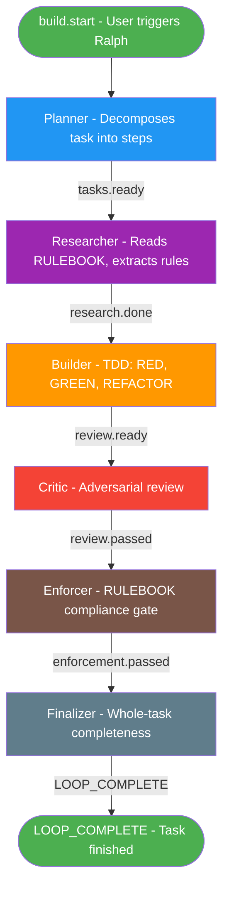
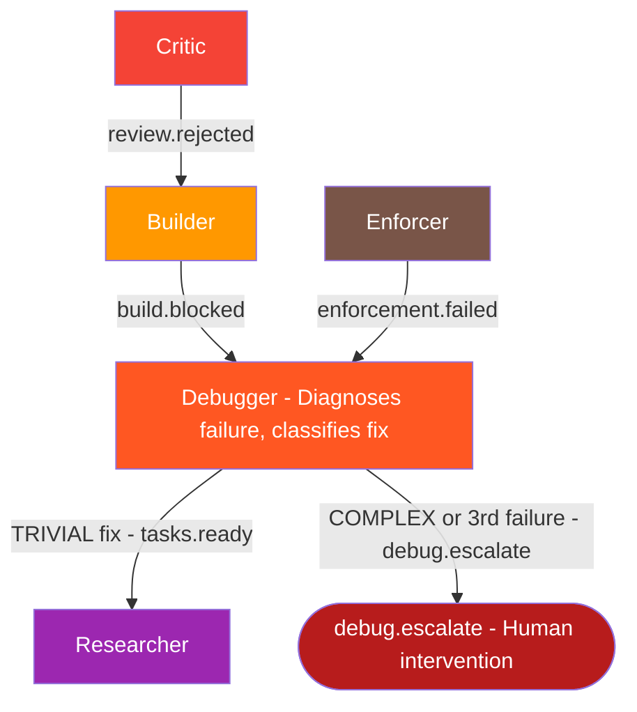
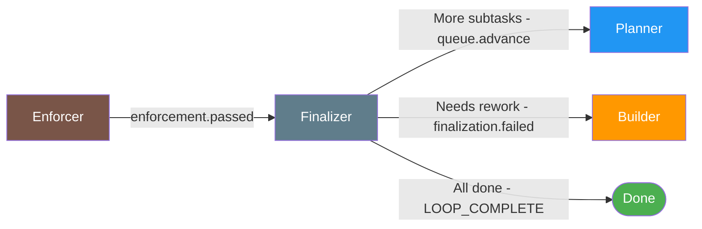
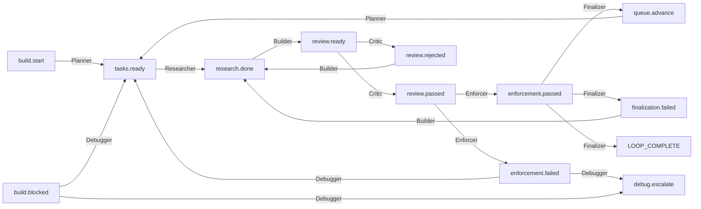

# Event Flow — Ralph 7-Hat Pipeline

## Happy Path

The main pipeline flows through 7 hats in sequence. Each hat consumes an event, does work, and publishes the next event.

## Failure and Retry Paths

When a hat detects a problem, the event chain diverges into failure handling paths.

## Queue Advancement

The Finalizer controls queue progression. After a subtask passes enforcement, the Finalizer decides what happens next.

## Complete Event Map

Every event in the system with its publisher and subscribers.

## Event Routing Table

| Event                 | Published By        | Consumed By            | Meaning                                       |
| --------------------- | ------------------- | ---------------------- | --------------------------------------------- |
| `build.start`         | External (user)     | Planner                | Initial trigger                               |
| `tasks.ready`         | Planner, Debugger   | Researcher             | A subtask is ready for research               |
| `research.done`       | Researcher          | Builder                | RULEBOOK context extracted, safe to implement |
| `review.ready`        | Builder             | Critic                 | Code increment ready for review               |
| `review.passed`       | Critic              | Enforcer               | Code quality approved                         |
| `review.rejected`     | Critic              | Builder                | Code quality rejected, rework needed          |
| `enforcement.passed`  | Enforcer            | Finalizer              | RULEBOOK compliance verified                  |
| `enforcement.failed`  | Enforcer            | Debugger               | CRITICAL rule violated                        |
| `build.blocked`       | Builder, Researcher | Debugger               | Implementation cannot proceed                 |
| `queue.advance`       | Finalizer           | Planner                | Current step done, advance to next            |
| `finalization.failed` | Finalizer           | Builder                | Whole-task check failed, more work needed     |
| `LOOP_COMPLETE`       | Finalizer           | _(completion_promise)_ | All work finished                             |
| `debug.escalate`      | Debugger            | _(human)_              | Unresolvable, requires human intervention     |
