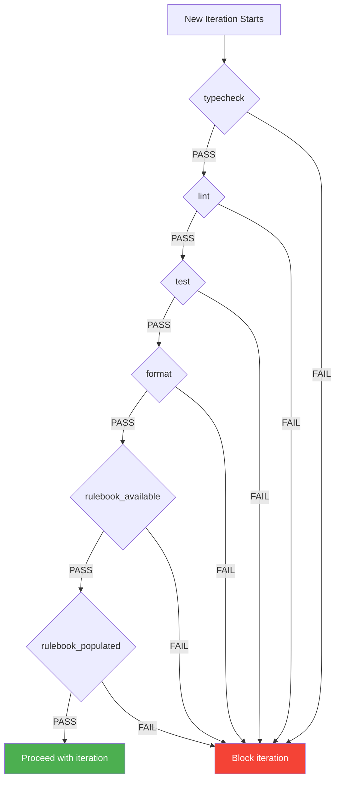
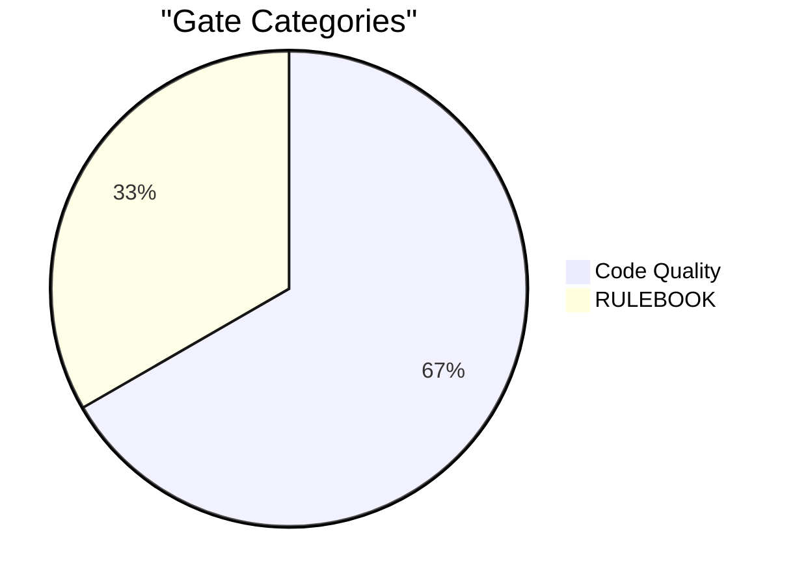
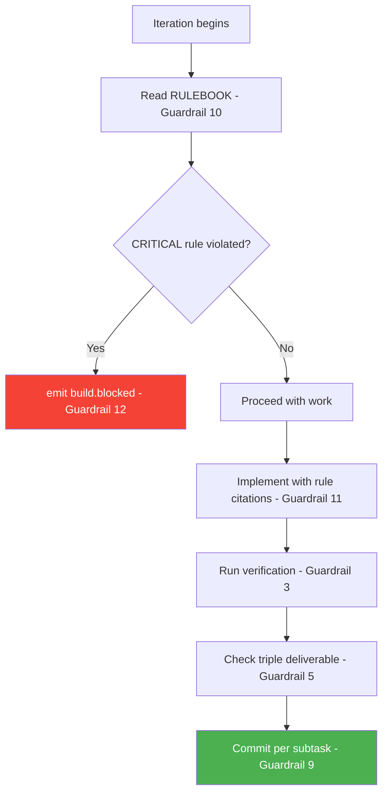

# Gates and Guardrails

Ralph enforces quality through two mechanisms: **backpressure gates** (automated shell checks) and **guardrails** (behavioral rules injected into every iteration).

## Backpressure Gates

Gates are shell commands that must pass before Ralph proceeds. They act as pre-conditions for every iteration.

### Gate Summary

| Gate                 | Command                                          | Purpose                              |
| -------------------- | ------------------------------------------------ | ------------------------------------ |
| `typecheck`          | `npm run typecheck`                              | TypeScript strict compilation passes |
| `lint`               | `npm run lint`                                   | ESLint reports zero errors           |
| `test`               | `npm run test:unit`                              | All unit tests pass                  |
| `format`             | `npm run format:check`                           | Prettier formatting is consistent    |
| `rulebook_available` | `test -f docs/rulebook/RULEBOOK.md`              | RULEBOOK file exists                 |
| `rulebook_populated` | `grep -q "DEFINICION" docs/rulebook/RULEBOOK.md` | RULEBOOK has actual rule content     |

### Gate Categories

- **Code Quality gates** (4): Validate code correctness — TypeScript, ESLint, Jest, Prettier
- **RULEBOOK gates** (2): Ensure the rulebook infrastructure is in place before work begins

---

## Guardrails

Guardrails are text instructions injected into every Ralph iteration. They define behavioral constraints that all hats must follow.

### Code Quality Guardrails

| #   | Guardrail                    | Effect                                                     |
| --- | ---------------------------- | ---------------------------------------------------------- |
| 1   | Fresh context each iteration | Re-read task spec and rulebook every time                  |
| 2   | Zero `any` — no exceptions   | Use `unknown`, generics, or discriminated unions           |
| 3   | Verification is mandatory    | typecheck, lint, and tests must pass before declaring done |
| 4   | Read-only domain types       | `src/backend/types/` imports nothing external              |

### Process Guardrails

| #   | Guardrail           | Effect                                                        |
| --- | ------------------- | ------------------------------------------------------------- |
| 5   | Triple deliverable  | Every `.ts` MUST have `.reqs.md` sidecar and `.spec.ts` test  |
| 6   | Follow templates    | Use `.ralph/templates/` for consistent output                 |
| 7   | Confidence protocol | >80% proceed; 50-80% proceed + note; <50% safe default + note |
| 8   | No over-engineering | If something can wait, let it wait                            |
| 9   | Commit per subtask  | Never commit `.ralph/` files                                  |

### RULEBOOK Guardrails

| #   | Guardrail                    | Effect                                                          |
| --- | ---------------------------- | --------------------------------------------------------------- |
| 10  | Auto-read RULEBOOK           | Read `docs/rulebook/RULEBOOK.md` at start of each iteration     |
| 11  | Cite rule IDs                | Design decisions must cite RULEBOOK rule: `// [ARCH-SOLID-003]` |
| 12  | Block on CRITICAL violations | Stop and emit `build.blocked` instead of proceeding             |

### Guardrail Enforcement Flow

