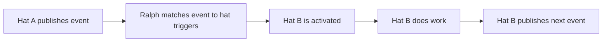
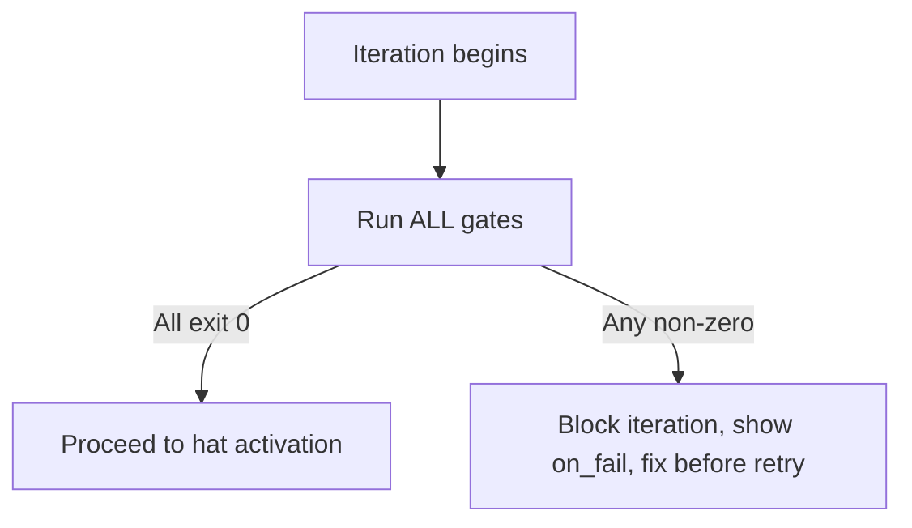

# Glossary — Ralph Orchestrator Terminology

Reference for all concepts used in the Ralph event-driven orchestration system.

---

## Core Concepts

### Ralph

An event-driven orchestrator that drives an AI agent (Claude) through a structured pipeline of specialized roles called **hats**. Defined in `ralph.yml` at the repository root.

### Event Loop

The main execution loop. Starts with a **starting event** (`build.start`), cycles through hats, and terminates when the **completion promise** (`LOOP_COMPLETE`) is emitted. Bounded by `max_iterations` and `max_runtime_seconds`.

```yaml
event_loop:
  completion_promise: 'LOOP_COMPLETE'
  starting_event: 'build.start'
  max_iterations: 100
  max_runtime_seconds: 14400
```

### Iteration

One full cycle of the event loop. In each iteration, Ralph:

1. Runs all **backpressure gates**
2. Reads the current event
3. Activates the **hat** that subscribes to that event
4. The hat does work and **publishes** a new event
5. The loop repeats with the new event

---

## Hats

A **hat** is a specialized role with a single responsibility. Each hat has a unique name, a set of events it listens to (**triggers**), and a set of events it can produce (**publishes**). Only one hat is active per iteration.

```yaml
builder:
  name: 'Builder'
  description: 'TDD implementer following RED -> GREEN -> REFACTOR'
  triggers: ['research.done', 'review.rejected', 'finalization.failed']
  publishes: ['review.ready', 'build.blocked']
  default_publishes: 'review.ready'
  instructions: |
    ## BUILDER MODE - TDD Implementation
    ...
```

### Hat Properties

| Property            | Required | Description                                                              |
| ------------------- | -------- | ------------------------------------------------------------------------ |
| `name`              | Yes      | Human-readable label                                                     |
| `description`       | Yes      | One-line summary of what the hat does                                    |
| `triggers`          | Yes      | List of event names that activate this hat                               |
| `publishes`         | Yes      | List of event names this hat can emit                                    |
| `default_publishes` | Yes      | The event emitted when the hat completes without explicitly choosing one |
| `instructions`      | Yes      | Full prompt injected when the hat is activated                           |

### The 7 Hats

| Hat            | Role                                        | Triggers                                                  | Publishes                                               |
| -------------- | ------------------------------------------- | --------------------------------------------------------- | ------------------------------------------------------- |
| **Planner**    | Decomposes task into steps, manages queue   | `build.start`, `queue.advance`                            | `tasks.ready`                                           |
| **Researcher** | Reads RULEBOOK, extracts applicable rules   | `tasks.ready`                                             | `research.done`                                         |
| **Builder**    | TDD implementation (RED → GREEN → REFACTOR) | `research.done`, `review.rejected`, `finalization.failed` | `review.ready`, `build.blocked`                         |
| **Critic**     | Adversarial code review                     | `review.ready`                                            | `review.passed`, `review.rejected`                      |
| **Enforcer**   | RULEBOOK compliance verification            | `review.passed`                                           | `enforcement.passed`, `enforcement.failed`              |
| **Debugger**   | Diagnoses and repairs failures              | `enforcement.failed`, `build.blocked`                     | `tasks.ready`, `debug.escalate`                         |
| **Finalizer**  | Whole-task completion gate                  | `enforcement.passed`                                      | `LOOP_COMPLETE`, `queue.advance`, `finalization.failed` |

---

## Events

An **event** is a named message passed between hats. Events are the only way hats communicate — there is no shared state. Each event carries a payload with context (task ID, task key, error details, etc.).

### Event Lifecycle



### Starting Event

The event that kicks off the entire loop. Defined in `event_loop.starting_event`. Always `build.start`.

### Completion Promise

The event that terminates the loop successfully. Defined in `event_loop.completion_promise`. Always `LOOP_COMPLETE`. When the Finalizer emits this event, Ralph stops iterating and returns control to the user.

### Default Publish

Every hat has a `default_publishes` value. If a hat finishes its work without explicitly emitting a specific event, Ralph uses the default. This is a safety mechanism — the loop always progresses.

- Critic defaults to `review.rejected` (reject unless proven correct)
- Enforcer defaults to `enforcement.failed` (fail unless proven compliant)
- Finalizer defaults to `finalization.failed` (fail unless proven complete)
- Debugger defaults to `tasks.ready` (retry by default)

### Orphan Event

An event that is published but has no hat listening for it. Two orphan events exist by design:

| Orphan Event     | Publisher | Why It Is Expected                                    |
| ---------------- | --------- | ----------------------------------------------------- |
| `LOOP_COMPLETE`  | Finalizer | Consumed by `completion_promise`, not a hat trigger   |
| `debug.escalate` | Debugger  | Intended for human intervention, no automated handler |

### Event Catalog

| Event                 | Published By        | Consumed By    | Meaning                |
| --------------------- | ------------------- | -------------- | ---------------------- |
| `build.start`         | User (external)     | Planner        | Initial trigger        |
| `tasks.ready`         | Planner, Debugger   | Researcher     | A subtask is ready     |
| `research.done`       | Researcher          | Builder        | RULEBOOK context ready |
| `review.ready`        | Builder             | Critic         | Code ready for review  |
| `review.passed`       | Critic              | Enforcer       | Code quality approved  |
| `review.rejected`     | Critic              | Builder        | Code needs rework      |
| `enforcement.passed`  | Enforcer            | Finalizer      | RULEBOOK compliant     |
| `enforcement.failed`  | Enforcer            | Debugger       | CRITICAL rule violated |
| `build.blocked`       | Builder, Researcher | Debugger       | Cannot proceed         |
| `queue.advance`       | Finalizer           | Planner        | Advance to next step   |
| `finalization.failed` | Finalizer           | Builder        | Whole-task incomplete  |
| `LOOP_COMPLETE`       | Finalizer           | _(completion)_ | All work done          |
| `debug.escalate`      | Debugger            | _(human)_      | Needs human help       |

---

## Guardrails

**Guardrails** are text instructions injected into every Ralph iteration, regardless of which hat is active. They define behavioral constraints that all hats must follow. Think of them as global rules that the AI agent must respect at all times.

```yaml
core:
  guardrails:
    - 'Zero `any` — no exceptions. Use unknown, generics, or discriminated unions.'
    - 'Triple deliverable: every .ts file MUST have its .reqs.md sidecar and .spec.ts test.'
    - 'Verification is mandatory — typecheck, lint, and tests must pass before declaring done.'
```

### Guardrail vs Hat Instruction

| Aspect         | Guardrail                    | Hat Instruction              |
| -------------- | ---------------------------- | ---------------------------- |
| **Scope**      | Global — applies to all hats | Local — applies to one hat   |
| **When**       | Every iteration              | Only when that hat is active |
| **Format**     | Single sentence/paragraph    | Full multi-section prompt    |
| **Purpose**    | Prevent unsafe behavior      | Guide specific work          |
| **Defined in** | `core.guardrails`            | `hats.<name>.instructions`   |

### The 13 Guardrails

#### Code Quality (4)

1. Fresh context each iteration — re-read task spec and rulebook
2. Zero `any` — no exceptions
3. Verification is mandatory
4. Read-only domain types

#### Process (5)

5. Triple deliverable for every `.ts` file
6. Follow templates in `.ralph/templates/`
7. Confidence protocol (>80% proceed, 50-80% note, <50% safe default)
8. No over-engineering
9. Commit per subtask, never commit `.ralph/` files

#### RULEBOOK (4)

10. Auto-read RULEBOOK at start of each iteration
11. Cite RULEBOOK rule IDs in design decisions
12. Block on CRITICAL rule violations
13. Read the Rulebook before writing any code

---

## Backpressure Gates

**Gates** are shell commands that must succeed before any iteration begins. They are pre-conditions — automated checks that prevent Ralph from proceeding when the codebase is in a broken state.

```yaml
backpressure:
  gates:
    - name: typecheck
      command: npm run typecheck
      on_fail: 'TypeScript compilation failed. Fix type errors before proceeding.'
```

### Gate Properties

| Property  | Required | Description                                               |
| --------- | -------- | --------------------------------------------------------- |
| `name`    | Yes      | Unique identifier                                         |
| `command` | Yes      | Shell command to execute (exit 0 = pass, non-zero = fail) |
| `on_fail` | Yes      | Error message shown to the agent when the gate fails      |

### Gate Execution Flow



All gates run every iteration. There is no skip mechanism. If any single gate fails, the entire iteration is blocked and the agent receives the `on_fail` message.

### The 6 Gates

| Gate                 | Command                                          | Category     |
| -------------------- | ------------------------------------------------ | ------------ |
| `typecheck`          | `npm run typecheck`                              | Code Quality |
| `lint`               | `npm run lint`                                   | Code Quality |
| `test`               | `npm run test:unit`                              | Code Quality |
| `format`             | `npm run format:check`                           | Code Quality |
| `rulebook_available` | `test -f docs/rulebook/RULEBOOK.md`              | RULEBOOK     |
| `rulebook_populated` | `grep -q "DEFINICION" docs/rulebook/RULEBOOK.md` | RULEBOOK     |

---

## Skills

**Skills** are reference files auto-loaded into every Ralph session. They are placed in directories configured under `skills.dirs` and provide persistent context without cluttering the main configuration.

```yaml
skills:
  enabled: true
  dirs:
    - .claude/skills
```

### Current Skills

| File                               | Purpose                                                                                 |
| ---------------------------------- | --------------------------------------------------------------------------------------- |
| `.claude/skills/RULEBOOK.md`       | Quick reference guide pointing to the canonical RULEBOOK at `docs/rulebook/RULEBOOK.md` |
| `.claude/skills/RULEBOOK-INDEX.md` | Maps RULEBOOK categories to applicable RTASKs                                           |

Skills are **not** copies of source files — they are concise reference guides that point to canonical locations. This avoids sync problems.

---

## Memories

**Memories** are persistent notes that survive across Ralph sessions. Hats can store and retrieve patterns, fixes, and decisions.

```yaml
memories:
  enabled: true
  inject: auto
  budget: 2000
```

### Memory Types

| Type      | Purpose                           | Example                                                |
| --------- | --------------------------------- | ------------------------------------------------------ |
| `fix`     | Solutions to problems encountered | "Forge storage API returns undefined for missing keys" |
| `pattern` | Reusable project patterns         | "Error classes extend REGError, not Error"             |

### Memory Commands

- `ralph tools memory add "text" -t fix` — Store a fix
- `ralph tools memory add "text" -t pattern` — Store a pattern
- `ralph tools memory search "query"` — Retrieve relevant memories

---

## Tasks (RTASK System)

### Ralph Task (RTASK)

A **Ralph Task** is a markdown file in `.ralph/tasks/` that defines a unit of work. Each task has YAML frontmatter and a full specification body.

### Task File Naming

```
.ralph/tasks/RTASK-{number}-{slug}.code-task.md
```

Example: `RTASK-001-project-foundation.code-task.md`

### Task Frontmatter

```yaml
---
id: RTASK-001
title: 'Project Foundation and Forge Manifest'
status: pending
priority: 1
type: infrastructure
dependencies: []
rulebook_refs: [FORGE-OPS-001, FORGE-OPS-002, ARCH-SOLID-001]
spec: docs/tickets/TASK-001-project-foundation.md
---
```

| Field           | Description                                            |
| --------------- | ------------------------------------------------------ |
| `id`            | Unique task identifier                                 |
| `title`         | Human-readable title                                   |
| `status`        | `pending`, `in-progress`, `completed`                  |
| `priority`      | Execution order (1 = highest)                          |
| `type`          | `infrastructure`, `backend`, `frontend`, `integration` |
| `dependencies`  | List of RTASK IDs that must complete first             |
| `rulebook_refs` | RULEBOOK rule IDs relevant to this task                |
| `spec`          | Path to the detailed spec in `docs/tickets/`           |

### Runtime Task

A **runtime task** is a granular subtask created by the Planner during execution. One Ralph Task produces many runtime tasks. The Builder handles exactly one runtime task per iteration.

### Task Queue

The Planner manages a **queue** of runtime tasks. Only one step's wave of tasks exists at a time. When a step completes, the Finalizer emits `queue.advance` and the Planner materializes the next step's tasks.

---

## Triple Deliverable

The **triple deliverable** is a mandatory pattern for every production `.ts` file. Three artifacts must be created together:

| Artifact             | Extension  | Purpose                                      |
| -------------------- | ---------- | -------------------------------------------- |
| Requirements sidecar | `.reqs.md` | Maps acceptance criteria to RULEBOOK rules   |
| Production code      | `.ts`      | The implementation                           |
| Test file            | `.spec.ts` | Unit tests verifying all acceptance criteria |

Creation order: `.reqs.md` → `.ts` → `.spec.ts`

See [triple-deliverable.md](./triple-deliverable.md) for full details.

---

## RULEBOOK

The **RULEBOOK** is the canonical collection of architectural and operational rules for the project. Located at `docs/rulebook/RULEBOOK.md`.

### Rule Format

Every rule follows the same 4-section structure:

| Section        | Description                               |
| -------------- | ----------------------------------------- |
| DEFINICION     | What the rule means                       |
| VALOR          | Why it matters (business/technical value) |
| IMPLEMENTACION | How to follow the rule                    |
| AUDITORIA      | How to verify compliance                  |

### Rule Categories

| Category   | Domain                                                                  |
| ---------- | ----------------------------------------------------------------------- |
| FORGE-OPS  | Forge runtime, manifest, storage, platform limits                       |
| SEC-PRIV   | Data handling, auth, scopes, OAuth, secrets                             |
| ARCH-SOLID | Types, models, adapters, orchestrators (SOLID, Clean Architecture, DDD) |
| TEST-QA    | Testing standards, coverage, TDD                                        |
| GIT-CI     | Git workflow, CI/CD, commit conventions                                 |
| UI-ADS     | Atlassian Design System, Custom UI                                      |
| ROVO-INTEG | Rovo AI adapter, resilience, triggers                                   |
| GH-INTEG   | GitHub integration, webhooks, API                                       |

### Priority Levels

| Priority | Behavior                                                         |
| -------- | ---------------------------------------------------------------- |
| CRITICAL | Non-negotiable. Violation blocks progress (Enforcer rejects).    |
| HIGH     | Should be followed. Exceptions require documented justification. |
| MEDIA    | Recorded but never blocks. Informational.                        |

### Priority Hierarchy

When rules conflict, higher-priority categories win:

1. FORGE-OPS (platform limits override everything)
2. SEC-PRIV (security overrides aesthetics)
3. GH-INTEG (GitHub API rules override generic patterns)
4. ARCH-SOLID (architecture patterns)
5. TEST-QA (testing standards)
6. GIT-CI (CI/CD conventions)
7. UI-ADS (UI guidelines)
8. ROVO-INTEG (Rovo/AI integration)

---

## Working Directory Structure

During execution, Ralph uses `.ralph/specs/{task_name}/` for shared state between hats:

```
.ralph/
├── tasks/                          # RTASK definition files
│   ├── RTASK-001-*.code-task.md
│   ├── RTASK-001.reqs.md
│   └── ...
├── specs/
│   └── {task_name}/
│       ├── context.md              # Planner: project patterns, dependencies, ACs
│       ├── plan.md                 # Planner: numbered high-level steps
│       ├── progress.md             # All hats: current state, notes, debug logs
│       └── rulebook-context.md     # Researcher: extracted rules for this task
└── templates/
    ├── reqs-template.md            # Template for .reqs.md sidecars
    ├── module-template.ts          # Template for production code
    └── spec-template.ts            # Template for test files
```
