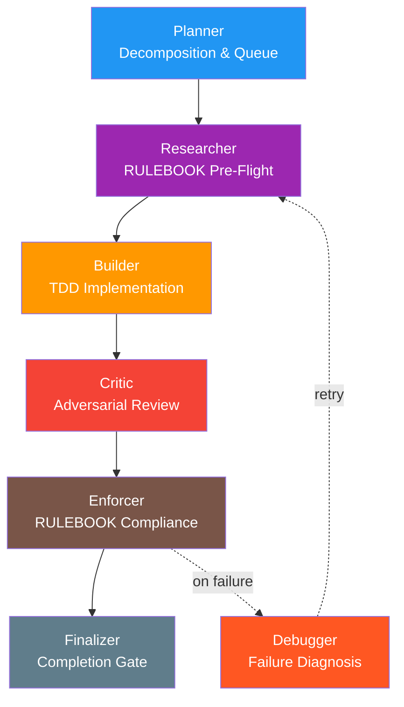
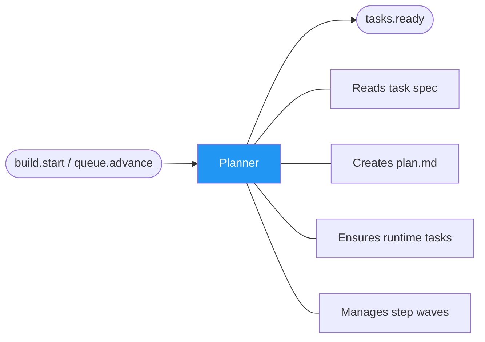
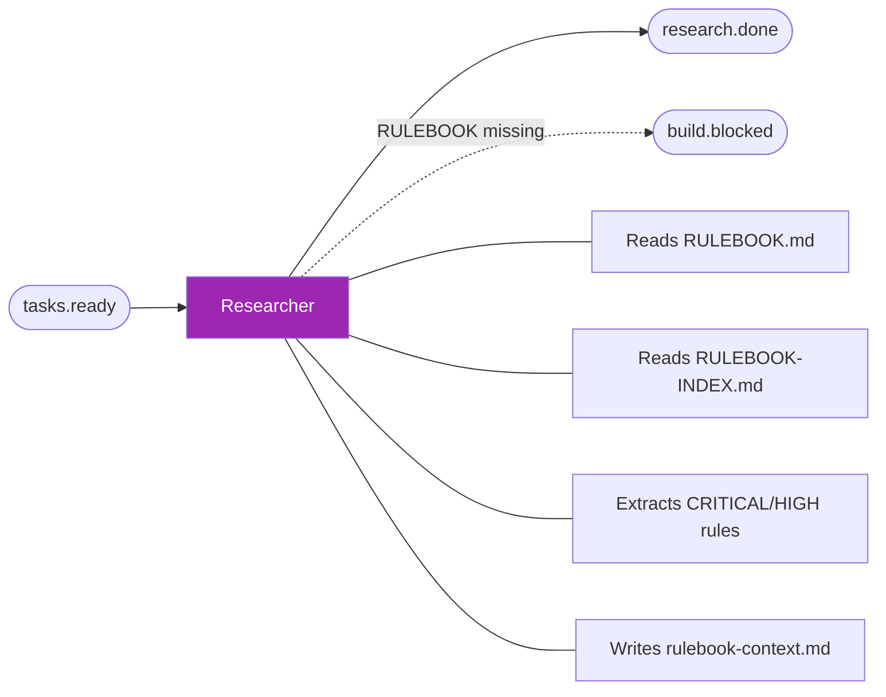
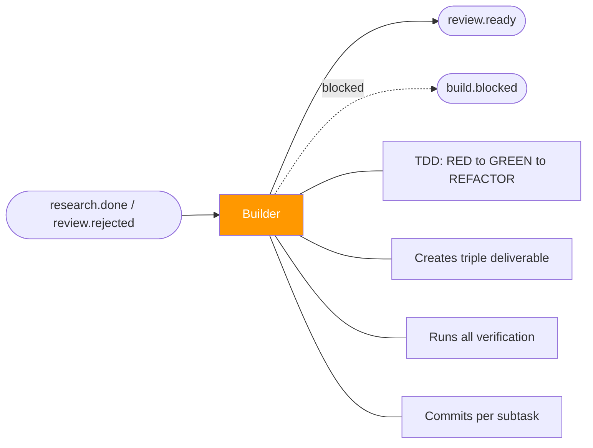
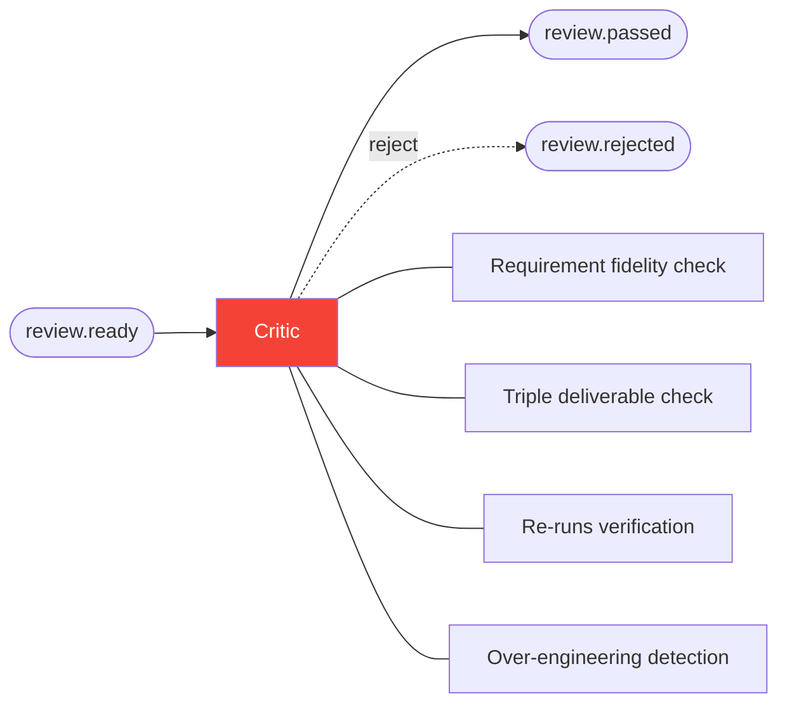
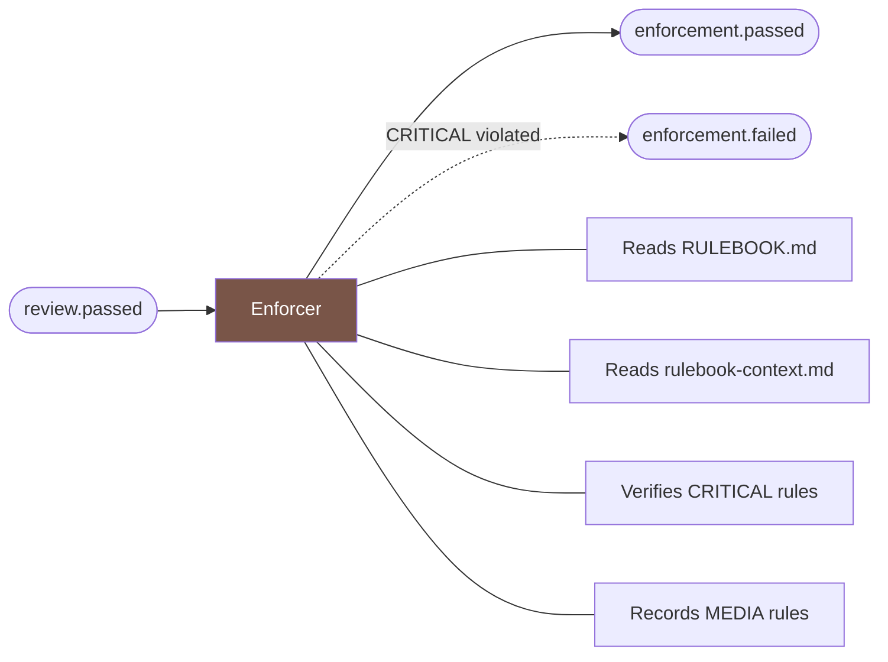
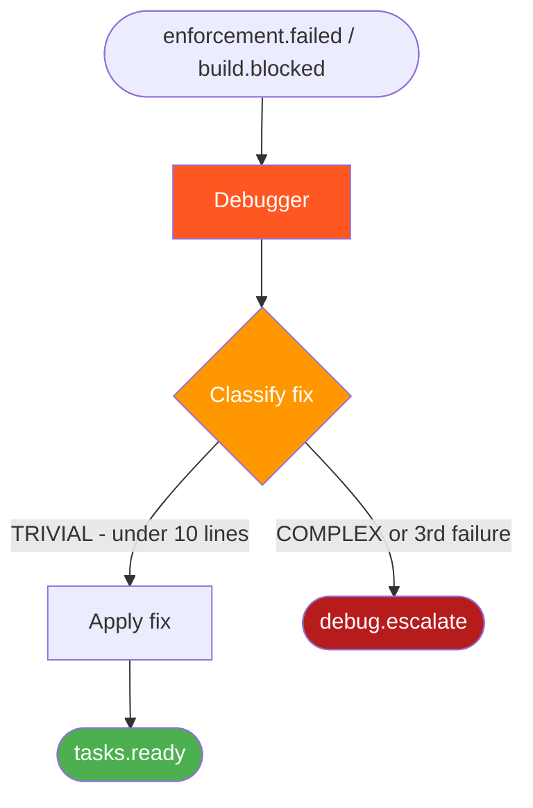
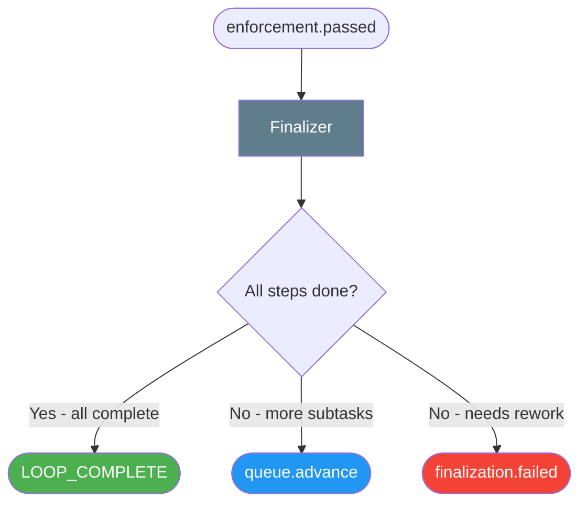

# Hats — Roles and Responsibilities

Ralph uses a hat system where each hat has a single responsibility. Hats communicate through events and never share state directly.

---

## Planner

| Property              | Value                                                                         |
| --------------------- | ----------------------------------------------------------------------------- |
| **Triggers**          | `build.start`, `queue.advance`                                                |
| **Publishes**         | `tasks.ready`                                                                 |
| **Role**              | Decomposes the Ralph task into numbered steps and manages the execution queue |
| **Rule**              | Does NOT implement. Does NOT review. Only decomposes.                         |
| **Working Directory** | `.ralph/specs/{task_name}/` — owns `context.md`, `plan.md`, `progress.md`     |

### Key Behaviors

- On `build.start`: reads task spec, creates working directory, writes `context.md` and `plan.md`, materializes Step 1 runtime tasks
- On `queue.advance`: checks if current step's wave is closed, advances to next step if so, ensures next wave of runtime tasks
- Task granularity: one focused subtask per runtime task (e.g., "Create src/backend/types/errors.ts with REGError base class")

---

## Researcher

| Property      | Value                                                                                  |
| ------------- | -------------------------------------------------------------------------------------- |
| **Triggers**  | `tasks.ready`                                                                          |
| **Publishes** | `research.done`                                                                        |
| **Role**      | Pre-implementation RULEBOOK consultation — extracts relevant rules before Builder acts |
| **Output**    | `.ralph/specs/{task_name}/rulebook-context.md`                                         |

### Key Behaviors

- Reads `docs/rulebook/RULEBOOK.md` and `docs/rulebook/RULEBOOK-INDEX.md` on every activation
- Identifies applicable RULEBOOK categories for the current task
- Extracts all CRITICAL and HIGH priority rules
- Verifies API constraints (rate limits, timeouts, permissions) if task involves external APIs
- Emits `build.blocked` if RULEBOOK is missing or empty

---

## Builder

| Property      | Value                                                     |
| ------------- | --------------------------------------------------------- |
| **Triggers**  | `research.done`, `review.rejected`, `finalization.failed` |
| **Publishes** | `review.ready`, `build.blocked`                           |
| **Role**      | TDD implementer — one task at a time, tests first         |
| **Rule**      | Implements ONE runtime task per iteration. Never batches. |

### Key Behaviors

- Follows strict TDD cycle: RED (failing test) → GREEN (minimal code) → REFACTOR (clean up)
- Creates triple deliverable for every `.ts` file: `.reqs.md` sidecar → `.ts` code → `.spec.ts` test
- Runs all 4 verification commands before emitting `review.ready`: `typecheck`, `lint`, `test:unit`, `format:check`
- Commit format: `type(scope): description [REG-XXX]`

---

## Critic

| Property      | Value                                            |
| ------------- | ------------------------------------------------ |
| **Triggers**  | `review.ready`                                   |
| **Publishes** | `review.passed`, `review.rejected`               |
| **Default**   | `review.rejected` (reject unless proven correct) |
| **Role**      | Fresh-eyes adversarial review — not the builder  |

### Key Behaviors

- Checks requirement fidelity: did Builder satisfy the task? Were ACs met? Were rules followed?
- Verifies triple deliverable: every `.ts` has `.reqs.md` and `.spec.ts`
- Re-runs verification commands (does NOT trust "it passes" claims)
- Detects over-engineering: extra files, unused types, premature abstractions
- Records durable patterns to memory: `ralph tools memory add "pattern" -t pattern`

---

## Enforcer

| Property      | Value                                                               |
| ------------- | ------------------------------------------------------------------- |
| **Triggers**  | `review.passed`                                                     |
| **Publishes** | `enforcement.passed`, `enforcement.failed`                          |
| **Default**   | `enforcement.failed` (fail unless proven compliant)                 |
| **Role**      | RULEBOOK compliance verification after Critic approves code quality |

### Key Behaviors

- Reads `docs/rulebook/RULEBOOK.md` and the Researcher's `rulebook-context.md`
- Verifies each CRITICAL rule is satisfied by the implementation
- For HIGH rules: verifies or documents justified exception
- MEDIA priority rules: records but never blocks
- Never blocks on style preferences or rules from non-applicable categories

---

## Debugger

| Property      | Value                                                          |
| ------------- | -------------------------------------------------------------- |
| **Triggers**  | `enforcement.failed`, `build.blocked`                          |
| **Publishes** | `tasks.ready`, `debug.escalate`                                |
| **Default**   | `tasks.ready` (retry by default)                               |
| **Role**      | Diagnoses and repairs gate failures and enforcement violations |

### Key Behaviors

- Reads the exact error from the triggering event
- Locates the file and line of the problem
- Classifies the fix: TRIVIAL (< 10 lines) → repair directly, COMPLEX → escalate, FALSE POSITIVE → escalate
- Anti-loop protection: after 3 consecutive failures of the same gate, always escalates
- Writes debug session log to `progress.md`

---

## Finalizer

| Property      | Value                                                   |
| ------------- | ------------------------------------------------------- |
| **Triggers**  | `enforcement.passed`                                    |
| **Publishes** | `queue.advance`, `finalization.failed`, `LOOP_COMPLETE` |
| **Default**   | `finalization.failed` (fail unless proven complete)     |
| **Role**      | Whole-task completion gate — the strictest check        |

### Key Behaviors

- Checks plan completion: all numbered steps done? All runtime tasks closed?
- Runs quality gates: `typecheck`, `lint`, `test:unit`
- Checks definition of done: all files exist, all sidecars exist, no `any` types
- Performs adversarial pass: tests edge cases and failure scenarios
- MUST be stricter than both Builder and Critic about what "done" means
