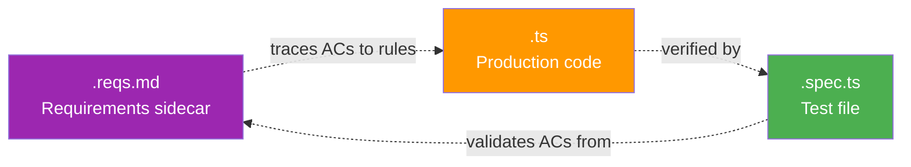
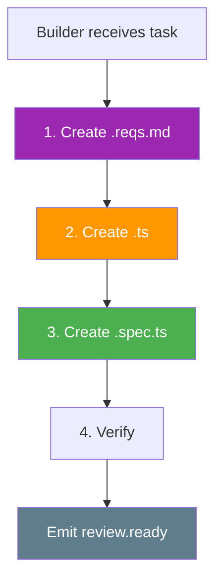
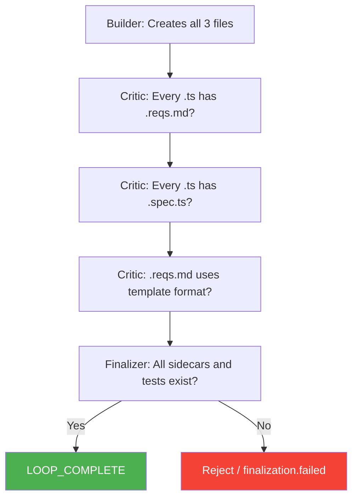

# Triple Deliverable Pattern

Every production `.ts` file in the Rovo Execution Guard project MUST produce three artifacts. This pattern ensures traceability from requirements through implementation to verification.

## The Three Artifacts



| Artifact        | Extension  | Purpose                                    | Template                              |
| --------------- | ---------- | ------------------------------------------ | ------------------------------------- |
| Requirements    | `.reqs.md` | Maps acceptance criteria to RULEBOOK rules | `.ralph/templates/reqs-template.md`   |
| Production Code | `.ts`      | The actual implementation                  | `.ralph/templates/module-template.ts` |
| Tests           | `.spec.ts` | Unit tests verifying behavior              | `.ralph/templates/spec-template.ts`   |

## Creation Order

The Builder must create artifacts in this specific order:



1. **`.reqs.md`** — List requirements from spec, map ACs to RULEBOOK rules
2. **`.ts`** — Implement production code, cite rule IDs in comments
3. **`.spec.ts`** — Write tests for all ACs, cover edge cases
4. **Verify** — Run typecheck + lint + test + format

## File Layout Example

For a module `src/backend/types/errors.ts`, the file structure is:

```
src/backend/types/
├── errors.ts          # Production code
├── errors.spec.ts     # Tests
└── errors.reqs.md     # Requirements sidecar
```

All three files live in the **same directory**.

## Validation Checkpoints

The triple deliverable is verified at multiple points in the pipeline:



## .reqs.md Structure

Every `.reqs.md` sidecar follows this structure (from `.ralph/templates/reqs-template.md`):

```markdown
# REQUISITOS: [Module Name]

> **Sidecar File** | Vinculado a: [production file path]

## Descripcion

[What this module does]

## Acceptance Criteria

- [ ] **AC-XX**: [criterion description]

## Reglas del Rulebook

| ID Regla  | Categoria  | Descripcion breve |
| --------- | ---------- | ----------------- |
| [RULE-ID] | [Category] | [Description]     |

## Contrato Publico (API del modulo)

[Public interface documentation]

## Dependencias (imports)

### Internas (proyecto)

### Externas (npm)

## Estrategia de Test

### Unit Tests

### Integration Tests

### E2E Tests

## Historial de Cambios

| Fecha | Tarea Ralph | Cambio |
| ----- | ----------- | ------ |
```

## Infrastructure Task Exception

Infrastructure tasks (config files like `manifest.yml`, `package.json`, `tsconfig.json`) do not produce `.spec.ts` test files. Instead, validation is tool-based:

| File Type       | Sidecar             | Validation             |
| --------------- | ------------------- | ---------------------- |
| `manifest.yml`  | `manifest.reqs.md`  | `forge lint`           |
| `package.json`  | —                   | `npm install`          |
| `tsconfig.json` | —                   | `tsc --noEmit`         |
| `.eslintrc.js`  | `.eslintrc.reqs.md` | `npm run lint`         |
| `.prettierrc`   | —                   | `npm run format:check` |
